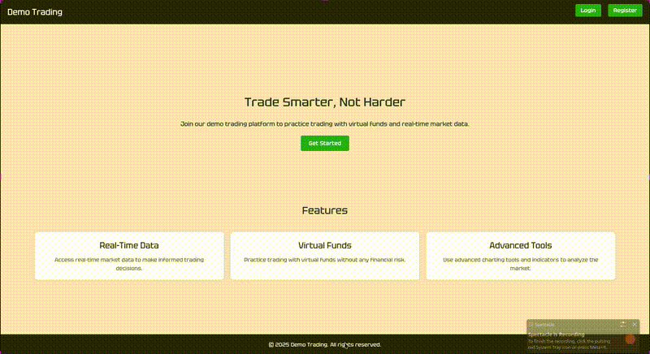

# Trading Simulator Web App

A full-stack **real-time trading simulation platform** that allows users to practice stock trading with live market-like data — without risking real money.  
This project is designed to help beginners understand trading dynamics through an interactive and responsive web interface.

---

## Demo

> 📽️ *Click below to view a short demo of the project in action.*




---

## Features

- **Real-Time Trading Simulation** – Users can buy/sell simulated stocks and track their virtual portfolio.
- **Secure Authentication** – Implemented using **Express sessions** and **JWT** for user protection.
- **Persistent Data Storage** – Managed user data and transactions using **PostgreSQL** on **Supabase**.
- **Live Data Updates** – Powered by **WebSockets** for instant updates on trade actions and stock prices.
- **Modern UI/UX** – Built with **React Hooks** and styled using **Tailwind CSS** for a responsive and clean design.

---


#🛠️ Tech Stack

| Layer | Technology |
|:------|:------------|
| **Frontend** | React, Tailwind CSS, WebSockets |
| **Backend** | Node.js, Express.js |
| **Database** | PostgreSQL (hosted on Supabase) |
| **Auth** | JWT + Express Session |
|  |

---

## ⚙️ Installation & Setup

Follow these steps to set up the project locally:

```bash
# Clone the repository
git clone https://github.com/saksham0806/Trading-Simulator.git
cd trading-simulator-webapp

# Install dependencies
npm install

# Add environment variables
# Create a .env file in the root directory and include:
# DATABASE_URL=your_supabase_postgres_url
# JWT_SECRET=your_secret_key

# Start the development server
npm run dev
cd APIS && nodemon index.js